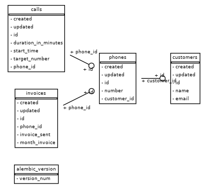

# Phone billing system
### Problem statement:
Implement a very simple phone billing system as a microservice using python.
- The microservice must be able to:
- Receive number of minutes for each customer call
- Provide the call history by user
- Calculate the period total and generate the invoice for a customer
To keep it simple we will consider we are handling only postpaid monthly plans and a flat rate of US$
0.02 per minute.

#### Other requirements:
- The system must have a database where call history and invoices are stored (you can use any
database).
- You can use any framework you believe best fits to the solution.
- Keep your code as clean as possible and implement unit tests.
- Provide code base and instructions to build and run your microservice.

#### Use cases:
- As a phone operator I want all customer calls to be charged.
- As a customer I want to be able to see my phone call history.
- As a customer I want to receive my invoice every first day of the month.

Additional task:
Describe how you would extend the solution to be able to support different billing plans like prepaid and
fixed amount per month.

# How to run the API

Having docker and docker-compose (1.29.2) installed run `make up` to get the API running in the forefront.
By default, it won't have any data, and there are no endpoints to create customers and phones associated.
To be able to interact with the API, you can run `make fixtures` and then go to `http://localhost:8000/docs` and use
the swagger helpers or use the endpoints directly as follows:

```bash 
curl -X 'GET' \
'http://localhost:8000/phone/1/history' \
-H 'accept: application/json'
```

To run the tests execute `make tests_docker`

# DB models



# Assumptions and additional questions 
- I've never done an API in fastAPI before, but I have been reading many good things about it and wanted to give it a try to learn something new. 
- To solve having different billing plans:
  - First of all we need a new table for plans associated on a 1-1 relationship to phone, so that we can charge correctly each phone of each customer.
  - Prepaid: We could have an endpoint where the phone operator could check how many seconds the plan has left before starting the call, so they would know when to cut the call if exceeded.
  - Fixed amount per month, understood as the customer pays a fixed amount per month and has infinite calls would only change the way we send invoices. The task that should be in charge of sending the invoices in emails (via sendgrid) would check the monthly plans and ignore the calls for the calculation.
  - To support the use case of invoices generated and sent on every first day of the month, we'd need some cron job orchestration and individual tasks per customer and phone that we can run in parallel, for which I'd use celery/rabbitmq with celery beat to signal the tasks on a fixed date.
  - If the invoices are generated on different dates depending on the user and plan, then we will need to periodically start a task that filters by the user specifications.